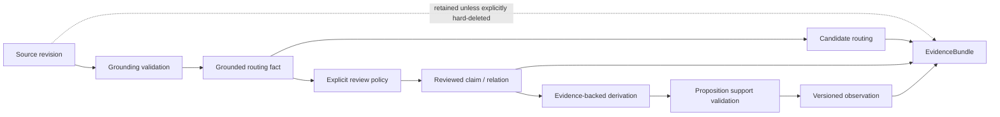

# Evidence Model

> Status: proposed additive extension. This document is not a description of
> the current graph and atomic-fact APIs until an implementation satisfies
> ADR-0015's promotion criteria.

The evidence model defines how lossless sources, structured retrieval records,
and derived observations coexist. It is the logical data contract proposed by
[ADR-0015](../adr/0015-evidence-grounded-formation-and-chain-retrieval.md).
The cognitive graph remains authoritative for activation and memory dynamics;
the evidence catalog is an additive, source-grounded retrieval representation.

## Authority and admission

| Record | Required provenance | May be returned as evidence? | May replace a source? |
|---|---|---:|---:|
| Source revision | Stable source and revision ids, origin, immutable content hash | Yes | No |
| Grounded routing fact | Exact `EvidenceRef`, formation profile, validation result | Only through its source | No |
| Reviewed claim | Evidence references and review record | Yes, with citations | No |
| Observation | Proposition-level support map, cited facts/sources, derivation version, grounding or review result, freshness state | Yes, with citations and its support map | No |

Admission is not a confidence score. It determines which operations a record may
perform. Confidence is still useful within an admission class, but high model
confidence cannot promote a routing fact into a reviewed claim.

`SourceRevision` is the immutable evidence unit. A stable source identity may
have several revisions, and a live graph node may remain a mutable compatibility
view of the active revision. Updating that view first appends a new source
revision and then atomically moves the active-revision pointer. Corrections,
retractions, and supersession add state or a new revision; they do not rewrite
the bytes to which existing citations refer.

An authorized hard deletion is distinct from correction. It must make every
dependent record and graph projection ineligible in the same transaction. A
retention policy may preserve the cited revision for audit or erase it and retain
only a deletion tombstone. In the latter case, the system must not continue to
claim raw traceability for the dependent record.

The current v13 atomic-fact compatibility lane does not yet provide immutable
`SourceRevision` records. It instead binds every cited raw node to a
storage-owned allocation generation plus an authority-field fingerprint.
Deletion and byte-identical numeric-id reuse rotate the generation; relevant
source changes alter the fingerprint. Missing legacy bindings fail closed and
are not reconstructed from the currently live node. This protects the current
lane from authority aliasing but does not replace the revision model proposed
here.

## Catalog records

### SourceRevision

| Field | Contract |
|---|---|
| `source_id` | Stable identity shared by revisions of one logical source |
| `revision_id` | Stable immutable revision identity used by citations |
| `content` / `content_hash` | Exact normalized bytes and their digest |
| `origin` / `visibility` | Provenance and visibility captured for this revision |
| `recorded_at` | Record time for this revision; not occurrence or validity time |
| `supersedes_revision` | Optional explicit predecessor; never inferred from time alone |
| `lifecycle` | Append-only current/retracted/superseded/deletion records projected separately from immutable revision bytes |

An active-revision pointer is mutable catalog state; a `SourceRevision` is not.
Text hydration always addresses a revision id, never “whatever content the live
node currently holds.”

### EntityRecord

| Field | Contract |
|---|---|
| `entity_id` | Stable catalog identity |
| `canonical_label` | Display label, not an identity key by itself |
| `aliases` | Normalized aliases, each with its own evidence references and visibility |
| `mentions` | Exact source-revision spans, each with its own visibility |
| `kind` | Optional consumer-defined classification |

Entity identity is scope-neutral: resolving two mentions to the same entity does
not reveal either mention, alias, or fact to a query that cannot read it. Entity
resolution must tolerate ambiguity. Similar labels remain separate until a
declared merge policy has sufficient evidence. A merge retains prior ids through
reversible redirect/lineage records rather than converting ids into text aliases.

### FactRecord

| Field | Contract |
|---|---|
| `fact_id` | Stable catalog identity |
| `subject` | Canonical entity reference or source-grounded literal |
| `predicate` | Normalized predicate identity |
| `object` | Entity reference or typed scalar/text value |
| `polarity` / `modality` | Affirmed, negated, uncertain, conditional, planned, or observed |
| `fact_kind` | Additive routing classification, independent of `KnowledgeType` |
| `time` | Occurred/observed/valid-time fields where known |
| `scope` | Intersection of source visibility |
| `admission` | Grounded routing, reviewed, or observation-derived |
| `confidence` | Calibrated evidence value within the admission class |
| `evidence_refs` | Non-empty set of exact source references |
| `formation` | Producer, profile/version, created time, validation/review state |
| `search_projection` | Versioned lexical surface used for lookup; not fact identity or reader evidence |
| `embedding` | Optional vector plus model/protocol/dimension digest identifying its embedding space |

Subject, predicate, and object are stored separately. Display and search
sentences are versioned projections, not the canonical fact identity. A vector
may be compared only with a query vector in the same declared embedding space.

### FactRelation

A fact relation connects two facts or a fact and an observation. The default
vocabulary is directed and closed enough for predictable traversal:

- `causes`
- `reason_for`
- `supports`
- `contradicts`
- `supersedes`
- `same_event`
- `sequence`

Consumers may add a namespaced custom relation. `sequence` never implies
`causes`. `contradicts` preserves both endpoints and is not a negative
conductance edge.

Endpoint evidence does not establish a relation. Every `FactRelation` therefore
stores:

| Field | Contract |
|---|---|
| `relation_id` | Stable catalog identity |
| `from` / `to` | Directed fact or observation endpoints |
| `relation_type` | Default or namespaced custom relation |
| `evidence_refs` | Non-empty relation-specific support, independent of endpoint citations |
| `admission` / `formation` | Grounding, review, producer, and profile/version provenance |
| `visibility` | Intersection of relation evidence visibility, checked independently of endpoints |
| `time` | Relation occurrence/validity constraints where known; missing validity bounds remain unbounded |

`Contradicts` is a non-propagating constraint. If one endpoint is already
eligible, retrieval may add the other visible endpoint and both provenance paths
to the tension channel. It cannot seed unrelated traversal, satisfy a positive
relation hop, or contribute positive chain continuity.

### EvidenceRef

Text evidence records stable source and revision ids, a byte range, revision
content hash, and optional speaker/session identity. Validation checks the cited
bytes against that immutable revision at admission and hydration.

Media evidence records an immutable registered asset id and hash, an image
region or audio/video time range, a normalized `SourceRevision`, and a consumer
validation receipt. The receipt binds adapter/profile identity, asset hash,
range, normalized-content hash, and formation time. The core validates receipt
shape, registered identities, hashes, and range bounds; it does not reopen,
decode, or semantically interpret the asset. A media-derived claim without
independently checkable textual grounding remains routing-only unless an
explicit review policy accepts it.

### ObservationRecord

An observation is an immutable, versioned synthesis. It stores its cited facts
and source revisions, derivation profile digest, visibility, time, freshness
state, and a support map from each asserted proposition to admitted inputs. A
citation list without proposition-level support is not sufficient for readable
admission: every proposition must pass deterministic grounding or an explicit
review policy. Otherwise the observation is rejected or restricted to routing.
A new derivation creates a new version and moves an explicit active-version
pointer. Source changes or contradictions make a dependent observation stale;
they do not erase it or silently select one side.

## Scope, time, and admission boundaries

The legacy `ScopePath` value is a ranking compatibility signal, not an
authorization primitive. Evidence-complete APIs add an `AuthorizedScopeSet` as
a hard eligibility input. Its membership is checked before catalog lookup,
graph seeding, chain traversal, hydration, and packaging. Consumers decide which
scopes enter that set; the engine never grants authorization. A legacy caller
that supplies only `ScopePath` retains existing ranking behavior and cannot claim
hard isolation.

Entity ids are scope-neutral. Every alias, mention, fact, relation, observation,
and evidence reference carries independently checked visibility. Derived
visibility is no broader than the intersection of its evidence references, and
an empty intersection makes the record ineligible.

Formation, observation, occurrence, validity, record, and access time remain
distinct. Missing observation or occurrence time is unknown and cannot satisfy a
slot requesting that axis. Missing `valid_from` or `valid_until` retains the
existing half-open interval contract and is unbounded on that side. No time axis
is copied into another to fill a missing value.

The shared admission boundary consumes source revisions, already formed typed
candidates, profile identity, and optional consumer review records. Extraction
from raw source/profile input remains consumer-owned. Direct `Memory`, daemon,
plugin, and evaluation adapters use identical admission inputs; model execution
is outside the parity contract.

## Catalog and graph relationship

The catalog does not replace graph nodes and edges:

- live source identities remain graph nodes with cognitive dynamics, while
  citations bind to immutable source revisions;
- facts and entity records provide selective indexes and typed routing;
- reviewed claims may project to graph nodes or edges when activation over them
  is part of a declared consumer contract;
- every such projection records its catalog identity and source references;
- retrieval deduplicates projections by source revision plus overlapping span or
  media region before packaging. Distinct revisions remain distinct evidence
  for queries about change over time.

This separation prevents domain vocabulary from expanding `KnowledgeType` and
keeps routing records from acquiring source authority merely because they are
graph-reachable.

Catalog-capable storage is exposed through a new additive extension trait, such
as `EvidenceCatalogStorage: StorageAdapter`. Existing `StorageAdapter`
implementations continue to compile unchanged. Operations requiring the catalog
are defined only for `Memory<S>` implementations whose storage satisfies that
bound. Existing adapters retain all existing raw ingest/recall APIs and
deterministic empty-catalog behavior; the existing trait does not gain new
required methods.

## Lifecycle

Validation failure omits the derived record and records an audit event. It never
blocks or deletes the source. Revocation removes a record from eligible
retrieval while retaining its provenance and history.

## Mutation, events, and snapshots

A source-revision write or live-source mutation and all dependent catalog
invalidation, graph projection changes, index-generation updates, and mutation
events form one transaction. Events preserve the existing
dependency-before-dependent order, and rollback emits none. Read-only retrieval
may report stale references but cannot repair admission or move an active-version
pointer.

Snapshot, clone, and restore include the cognitive graph, source revisions,
catalog records, admission and freshness state, active-version pointers, and
graph/catalog generation keys as one consistent state. Restoring only the graph
would make citations, caches, and eligibility disagree and is invalid.

Normal retrieval is bounded by deterministic depth, visited-record, candidate,
and token budgets. Elapsed wall time is telemetry, not a ranking input. Caller
cancellation or an emergency deadline produces an explicit incomplete/cancelled
outcome and cannot be used as a reproducible normal result.

## Invariants

- Every derived record has at least one valid source-revision reference. Every
  relation has relation-specific support, and every observation proposition has
  a support-map entry whose asserted linkage is grounded or explicitly reviewed;
  review never replaces provenance.
- Routing facts route to source evidence and are never rendered alone.
- Source revisions are immutable. Live source changes create a revision and
  invalidate dependents atomically; authorized deletion cannot leave a dependent
  record eligible.
- Entity identity is scope-neutral. Visibility is enforced on each mention,
  alias, fact, relation, observation, and evidence reference by
  `AuthorizedScopeSet`; legacy `ScopePath` remains ranking-only.
- Derived visibility is the intersection of evidence-reference visibility.
- Missing observation/occurrence time remains unknown; missing validity bounds
  are unbounded. Time axes never substitute for one another.
- Entity merges and record promotion are explicit, versioned, and reversible.
- `Contradicts` is non-propagating; contradictions, retractions, and superseded
  versions remain auditable.
- Display/search projections and embeddings are versioned retrieval fields, not
  canonical fact identity; embeddings are compared only within one identified
  space.
- Read-only retrieval does not change admission, review, freshness, active
  versions, or generation keys, and normal results do not depend on wall time.
- Catalog/graph mutations, events, snapshots, and rollback preserve one
  consistent state.
- Formation admission and retrieval accept only inputs declared by their public
  runtime contracts.

## Related documents

- Formation and admission are defined in
  [ingestion-layers.md](../01-system-architecture/ingestion-layers.md).
- Time axes are defined in [temporal-model.md](temporal-model.md).
- Retrieval and hydration are defined in
  [pipeline.md](../05-context-retrieval/pipeline.md).
- Persistence requirements are defined in
  [storage.md](../03-persistence/storage.md).
