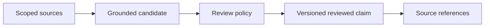

# Scope And Proposed Promotion

`ScopePath` is current applicability and ranking metadata. It is neither an
authorization system nor a confidence score. The current engine does not accept
an authorized-scope set and does not guarantee that a nonmatching scope is
absent from retrieval. Consumers enforce access control before calling the
engine, for example by selecting an appropriate store or filtering the source
surface.

## Current scope contract

`ScopePath` is an opaque canonical string plus the universal scope. Current
retrieval scoring distinguishes:

- identical scopes, or a pair in which either side is universal, with weight
  `1.0`; and
- two different concrete scopes, with attenuated weight `0.5`.

Paths use `/` as a separator, trim a trailing separator, and reject empty
segments. The current engine does not infer ancestor, descendant, or sibling
relationships from string prefixes. A consumer that needs hierarchical
authorization must resolve and enforce the permitted data set before calling
the engine.

The current scope value is also stamped onto atomic facts from their cited raw
sources. It remains routing metadata; it does not turn the sidecar into an
access-control boundary.

## Proposed: Derived-Record Eligibility (ADR-0015)

The evidence catalog proposed by
[ADR-0015](../adr/0015-evidence-grounded-formation-and-chain-retrieval.md)
would use a strict no-widening rule over a caller-supplied eligible scope set:

```text
eligible(derived) ⊆ intersection(eligible(source_1), ..., eligible(source_n))
```

Every proposed fact, relation, observation, and retrieval-chain hop would have
to be eligible for the query. A universal source would not make a restricted
companion source universal. If the intersection were empty, the derived record
would be invalid and the chain would not be traversable. No
`AuthorizedScopeSet` type or equivalent hard gate exists in the current API.

## Proposed: Promotion

ADR-0015 proposes that promotion add a reviewed synthesis or claim without
editing a source or silently broadening caller-supplied eligibility.

| Requirement | Contract |
|---|---|
| evidence | Every promoted record cites its immutable sources |
| policy | A named consumer review policy authorizes the promotion |
| scope | The promoted record is no broader than its sources unless an external authorization decision creates a separately sourced public claim |
| time | Validity and supersession are explicit |
| reversibility | Revocation removes eligibility while retaining provenance |



An external authorization decision that publishes a new claim is itself a new
source event with its own origin, not an implicit mutation of the restricted
sources.

## Proposed Retrieval Rules

- The caller supplies and vouches for an eligible query scope set.
- Scope gates run before candidate fusion and at every chain hop.
- Packaging rechecks the selected evidence; an ineligible source cannot leak
  through an eligible derived summary.
- Contradiction bundles are returned only when both sides are eligible.
- Read-only retrieval never promotes or broadens a record.

These rules are acceptance requirements for ADR-0015. They are not guarantees
of current `ScopePath` scoring.

## Related documents

- Origin is defined in [peer-identity.md](peer-identity.md).
- Evidence admission is defined in [evidence-model.md](evidence-model.md).
- Temporal compatibility is defined in [temporal-model.md](temporal-model.md).
- Retrieval packaging is defined in
  [pipeline.md](../05-context-retrieval/pipeline.md).
