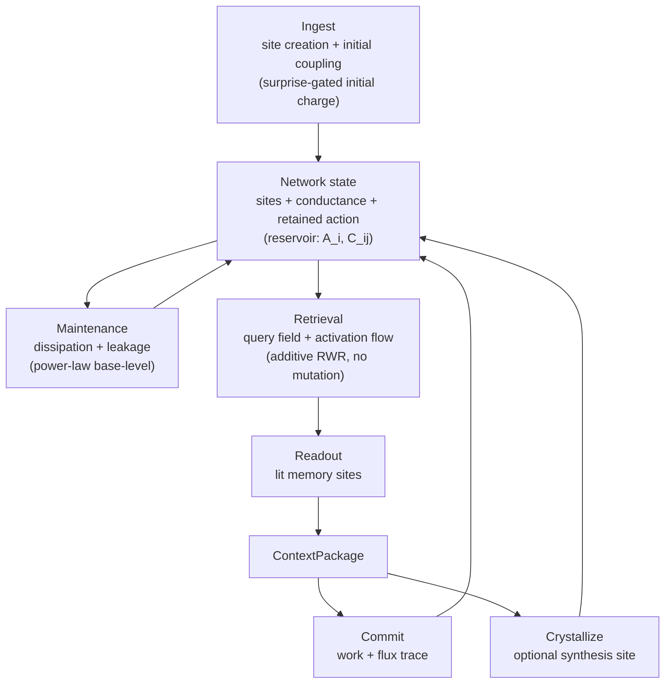

# Engine Dynamics Overview

The theoretical base of the cognitive dynamics engine is **spreading activation (ACT-R)**: cues activate related memories, activation spreads through associations, evidence from multiple paths is summed, and distance and time attenuate the signal. Anamnesis expresses that activation flow as a path-dependent **conductive network**. The conductive frame is a representation of spreading activation, not a separate theory.

The graph is not a static document list. It is a driven-dissipative network: a query field induces activation current; committed use updates conductance and retained action; time leaks unused retained action away. Energy/Lyapunov language is exact only under symmetric coupling. Directed RWR is driven-dissipative, so energy is an interpretive descent objective, while the true fixed point is the RWR stationary vector.

## Core Axiom

```text
retained action A_i = ACT-R base-level activation = log NEED-ODDS
conductance  C_ij  = associative strength       = log LIKELIHOOD RATIO

query activation a_i is transient and is never stored.

total A_i = B_i + sum_j W_j * S_ji
          = log prior odds + sum log likelihood ratios
          = log posterior odds
```

Retained action is prior need-odds. Conductance is the likelihood-ratio contribution of a cue. Retrieval computes posterior need-odds. `salience` is a bounded projection of `A_i`; `edge weight` is a bounded projection of `C_ij`.

The resulting rule is strict: **do not set these magnitudes directly**. Graph state changes only through integrated interactions whose increments are justified by Bayesian/ACT-R meaning.

## Three Loops



Retrieval settles quickly inside a query and stores nothing. Maintenance and commit are slower between-query updates to the reservoirs.

## Shared Inputs

| Input | Use |
|---|---|
| node type | leakage prior, packaging bucket, coupling prior |
| retained action | salience projection, readout prior, maintenance |
| conductance | activation flow, path selection, consolidation |
| origin | scope, trust, peer reflection |
| valid interval | `fact_at` and temporal filtering |
| embedding | field alignment, surprise, cold-start coupling |

## Shared Invariants

- `salience` is a projection of retained action, not a public control knob.
- `edge weight` is a projection of conductance, not authoritative state.
- Activation, current, impedance, and stress are query-local transient state.
- Read-only retrieval cannot create hidden mutation.
- Graph state changes only through committed interactions.
- Contradictions are surfaced as frustration/tension, not auto-judged.
- Persistent projections stay in closed ranges.
- Importance is emergent: well-connected, low-impedance, often-used sites become easier to activate without a separate gravity or mass force.

## Flow Responsibilities

| Flow | Reads | Writes | Result | Bayesian Meaning |
|---|---|---|---|---|
| perception | observation, scope, confidence | site or initial coupling | ingest result | surprise-gated initial charge |
| conductance | nearby sites, entity overlap, flux trace | conductance reservoir | conductive edges | bounded Hebbian update toward log-LR |
| potential landscape | query field, retained action, conductance | nothing persistent | basin bias and impedance | restart seed from log prior odds |
| dissipation | time, leakage prior, retained action | retained-action projection | tick report | base-level aging |
| frustration | contradiction constraints, active response | tension trace | surfaced conflict | constraint stress |
| readout | flow, impedance, scope, stress | nothing persistent | ranked sites | posterior odds crosses sink/threshold |
| interaction | committed usage event | retained action, conductance, trace | update report | prediction-error and flux integration |
| social | peer metadata | entity coupling or trust adjustment | reflect report | peer evidence updates coupling/trust |

## Computation Style

Mechanics should be pure functions where possible. `Engine` orchestrates storage access; calculation functions take typed inputs and return transient responses or projected state.

```text
phi_i       = potential_bias(query_field, site_i)
a_i         = restart * seed_i + (1 - restart) * sum_j P_ji * a_j
I_ij        = current(a_i, conductance_ij, edge_type_factor_ij)
W_readout_i = accepted_i * a_i * phi_i            # illustrative sketch only
dC_ij       = eta * flux_ij * (1 - C_ij)
C_next      = clamp_log_odds(C_ij + dC_ij)
A_next      = A_i + dV ; dV = eta_fb * (lambda - sumV)
s_next      = project_salience(A_next - leakage_i)
```

The restart rate is derived from associative reach, not chosen as an arbitrary knob: expose mean reach `L` and set `alpha = 1/(L+1)`. (Equivalently, if influence should decay to `f` after `h_half` hops, `alpha = 1 - f^(1/h_half)` is the same single reach degree of freedom.) `alpha` is the only restart knob here; the `eta_fb` in the feedback update above is a distinct quantity (see below).

`W_readout_i` above is an illustrative sketch, not the readout definition. The authoritative readout score is the additive log-odds re-ranking defined in [readout-scoring.md](readout-scoring.md) (`w_a * logit_or_rank(a_i) + w_phi * phi_i + w_s * logit(s_i) - w_z * Z_i + w_scope * scope + w_trust * trust - w_stress * stress`). Where the two differ, defer to [readout-scoring.md](readout-scoring.md).

`I_ij` includes the within-row edge type factor; its definition `I_ij = a_i * project_conductance(C_ij) * edge_type_factor_ij` lives in [activation-flow.md](../05-context-retrieval/activation-flow.md). `dC_ij` here is the unified commit-gated form: the `flux_ij` is the committed-usage flux (`path_used * I_ij` and `co_readout * min(a_i, a_j)`), not a raw `a_i * a_j` product; see [conductance.md](conductance.md) for the gated update and its `(1 - C_ij)` Oja bound. The feedback learning rate `eta_fb` is the Rescorla-Wagner rate `eta = 1 - 0.5^(1/N)` derived from the co-activation target `N` (see [interactions.md](interactions.md)); despite the shared Greek letter in some prose, it is **not** the RWR restart rate `alpha = 1/(L+1)`.

## Failure Conditions

- Out-of-range configuration values fail engine creation or the call boundary.
- Non-finite calculation results become errors.
- Unknown node ids return `NodeNotFound`; unknown edge ids return `EdgeNotFound`. `StorageError` is reserved for backend failures.
- A zero token budget returns empty context and trace.
- Commit traces that do not match retrieval traces fail interaction validation.
- Attempts to set reservoirs directly through retrieval violate invariants.

## Document Map

- [perception.md](perception.md): surprise-gated site allocation and routing.
- [conductance.md](conductance.md): Oja-bounded Hebbian conductance updates.
- [potential-landscape.md](potential-landscape.md) and [readout-scoring.md](readout-scoring.md): RWR flow and readout.
- [dissipation.md](dissipation.md): power-law base-level retention and telemetry separation.
- [interactions.md](interactions.md): committed work, reinforcement, and flux traces.
- [frustration.md](frustration.md): contradiction as constraint stress.
- [energy.md](energy.md): symmetric Lyapunov caveat vs directed RWR.
- [social.md](social.md): peer evidence, coupling, and trust updates.
