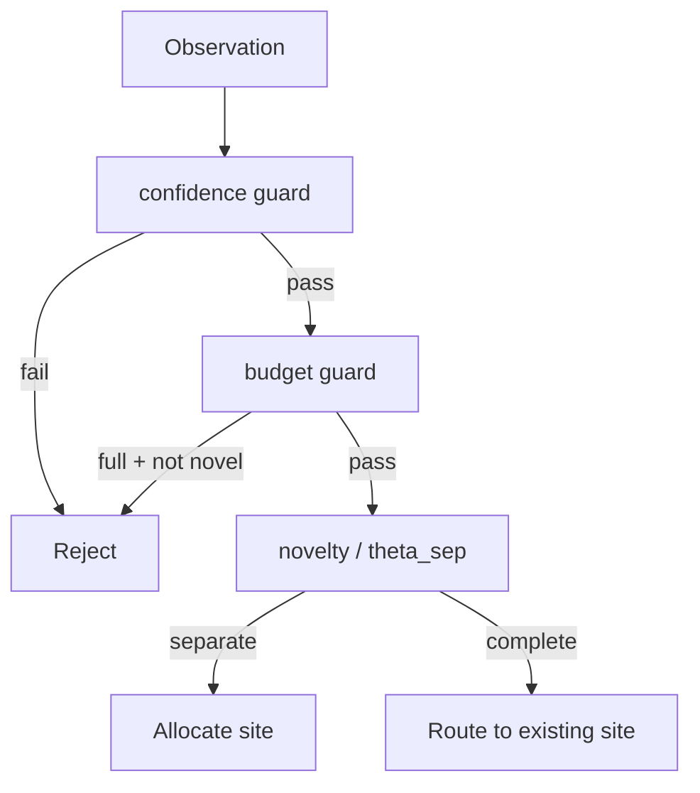

# Perception

Perception decides what an external observation is allowed to change when it enters the graph.

Two principles define the gate:

1. **Familiarity is not rejection.** Repeated knowledge routes to an existing site and reinforces it. The gate blocks untrusted input and unacceptable cost, not similarity by itself.
2. **Initial charge comes from surprise.** New sites do not all receive the same seed. Their retained action is proportional to precision-weighted prediction error.

## Inputs

| Input | Meaning |
|---|---|
| content | Source fragment |
| node type hint | Consumer-proposed classification |
| embedding | Semantic coordinate used for surprise and routing |
| confidence | Origin confidence |
| timestamp | Record time |
| valid interval | Fact time |
| metadata | Entity tags, source kind, and related fields |

## Decisions

The gate has two stages. Rejection happens only in stage 1. Stage 2 routes surviving observations.

| Result | Stage | Condition | State Change |
|---|---|---|---|
| Reject | Stage 1 | low confidence or budget full and not novel | none; return reason |
| Allocate | Stage 2 | novelty `> theta_sep` | new site, surprise-gated `A_i`, coupling seed |
| Route | Stage 2 | novelty `<= theta_sep` | reinforce existing site; no new site |

`A_i` is retained action. Public salience is its projection. Perception never sets salience directly.

## Gate Order



The old rule "low novelty means reject" is removed. Familiar input reinforces existing memory.

## Novelty And `theta_sep`

Novelty is the distance from the nearest candidate site. `theta_sep` is calibrated from the embedding encoder, not chosen arbitrarily. Measure the cosine-similarity distribution for distinct sentence pairs and use the high percentile as the separation boundary.

```text
theta_sep = 1 - q95(similarity_distinct_pairs)
```

If novelty is greater than `theta_sep`, the observation is farther from known sites and should allocate a new site. Otherwise it completes a known pattern and routes to the nearest site.

## Allocate: Surprise-Gated Initial Charge

```text
eps = (embedding_obs - embedding_pred)^T Sigma^-1 (embedding_obs - embedding_pred)
dA_i = k * eps
```

`eps` is a computable proxy for Bayesian surprise. Anamnesis does not have an explicit generative model, so literal KL is approximated by precision-weighted embedding error.

This avoids the white-snow paradox: high Shannon information that does not change belief receives little charge; inputs far from prior expectation receive more.

## Route: Reinforce The Matched Site

When novelty is below the separation threshold, route to the nearest site and reinforce it:

```text
dA_i = eta(novelty) * (lambda - current_prediction_i)
```

The update has diminishing returns because it is proportional to prediction error. `eta` can increase with novelty and should be calibrated from observed learning behavior.

## Duplicate Handling

Duplicate does not mean byte-identical text. Same entity, high embedding similarity, matching scope, and overlapping fact time all indicate same-knowledge routing. Perception absorbs these signals through the `theta_sep` branch instead of adding a separate veto.

## Rejection Trace

| Reason | Meaning |
|---|---|
| `low_confidence` | Origin confidence failed stage 1 |
| `budget_exceeded` | Node budget is full and input is not novel |
| `invalid_scope` | Scope path violates policy |
| `malformed_observation` | Required fields are missing |

Similarity alone is not a rejection reason.

## Failure Conditions

| Failure | Symptom | Response |
|---|---|---|
| uncalibrated `theta_sep` | over/under-segmentation | recalibrate on distinct pairs |
| no precision estimate | surprise scale is arbitrary | store/update variance or declare `k` calibrated |
| budget veto too broad | novel input rejected despite budget policy | guard only when full and not novel |
| paraphrase misrouting | distinct knowledge merged | use advisory conflict band and adjudication |

## Cost

| Step | Cost |
|---|---|
| novelty | top-k neighbor cosine over candidates |
| surprise | one neighbor prediction and precision pass |
| allocate | one site plus top-k coupling edges |
| route | one retained-action update |

## Related Documents

- Coupling seed is defined in [conductance.md](conductance.md).
- Reinforcement boundaries are defined in [interactions.md](interactions.md).
- Dissipation is defined in [dissipation.md](dissipation.md).
- Origin confidence is defined in [peer-identity.md](../02-knowledge-model/peer-identity.md).
- Storage budget is defined in [storage.md](../03-persistence/storage.md).
