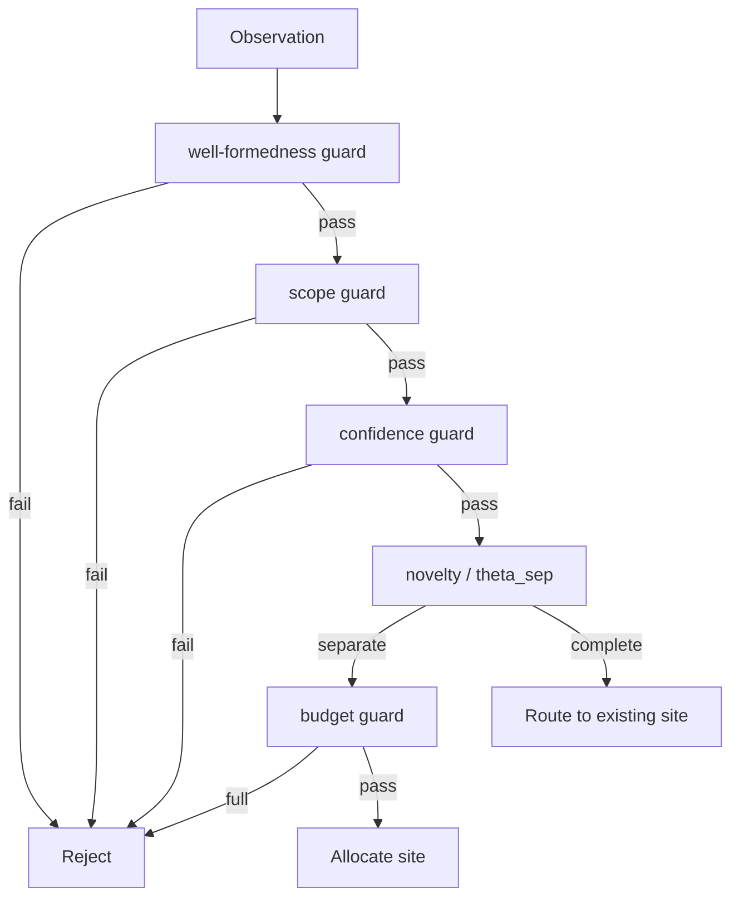

# Perception

Perception decides what an external observation is allowed to change when it enters the graph.

Two principles define the gate:

1. **Familiarity is not rejection.** Repeated knowledge routes to an existing site and reinforces it. The gate blocks untrusted input and unacceptable cost, not similarity by itself.
2. **Initial evidence prior comes from surprise.** New sites do not all receive the same seed. Their initial evidence prior `P_i` is proportional to precision-weighted prediction error.

## Inputs

| Input | Meaning |
|---|---|
| content | Source fragment |
| node type hint | Consumer-proposed classification |
| embedding | Semantic coordinate used for surprise and routing |
| confidence | Origin confidence |
| timestamp | Record time |
| valid interval | Fact time |
| metadata | Entity tags, source kind, and related fields |

## Decisions

The gate has two stages. Rejection happens only in stage 1. Stage 2 routes surviving observations.

| Result | Stage | Condition | State Change |
|---|---|---|---|
| Reject | Stage 1 | required fields missing (malformed) | none; return reason |
| Reject | Stage 1 | scope path violates policy | none; return reason |
| Reject | Stage 1 | low confidence, or budget full and observation is novel (would need a new site) | none; return reason |
| Allocate | Stage 2 | novelty `> theta_sep` | new site: `P_i <- k*eps`, creation trace stamped (seeds `B_i`), coupling seed |
| Route | Stage 2 | novelty `<= theta_sep` | append an access trace (raises `B_i`); may update `P_i`; no new site |

Stage 1 evaluates these guards in order: well-formedness, then scope validity, then confidence, then budget. The four guards correspond one-to-one with the reasons in the [Rejection Trace](#rejection-trace).

Node persistent strength decomposes into two terms: `A_i = B_i + P_i`. `B_i` is the multi-trace ACT-R base-level activation over the node's access traces (it owns forgetting and use-driven reinforcement); `P_i` is the decay-exempt evidence prior (encoding surprise, feedback, peer trust). Public salience is the bounded logistic projection of the sum: `s_i = logistic(B_i + P_i)`. Perception never sets salience directly.

## Gate Order



The old rule "low novelty means reject" is removed. Familiar input reinforces existing memory.

## Novelty And `theta_sep`

Novelty is the distance from the nearest candidate site. `theta_sep` is not a free knob: it is derived deterministically from the embedding encoder's distinct-pair similarity distribution. Measure the cosine-similarity distribution for distinct sentence pairs and take the 95th percentile as the separation boundary. Given the fixed 95th-percentile convention, `theta_sep` carries no behavioral freedom; its only input is the encoder distribution, so it recomputes exactly whenever the encoder changes.

```text
theta_sep = 1 - q95(similarity_distinct_pairs)
```

If novelty is greater than `theta_sep`, the observation is farther from known sites and should allocate a new site. Otherwise it completes a known pattern and routes to the nearest site.

## Allocate: Surprise-Gated Evidence Prior

```text
eps = (embedding_obs - embedding_pred)^T Sigma^-1 (embedding_obs - embedding_pred)
P_i <- k * eps
```

Allocation does two things: it seeds the evidence prior `P_i <- k * eps`, and it stamps a creation trace at `now` that seeds the base-level term `B_i`. `eps` is a computable proxy for Bayesian surprise: the precision-weighted (Mahalanobis) embedding distance between observation and prediction. Anamnesis does not have an explicit generative model, so literal KL is approximated by precision-weighted embedding error. `k` is the single calibrated scalar that converts this surprise into the initial evidence prior `P_i <- k * eps`. It is the one magnitude that cannot be derived from theory alone: absent a stored precision matrix `Sigma`, `k` absorbs both units and variance, so it must be declared and calibrated from embedding-encoder statistics and the target initial evidence-prior magnitude.

This avoids the white-snow paradox: high Shannon information that does not change belief contributes little to the evidence prior; inputs far from prior expectation contribute more.

## Route: Reinforce The Matched Site

When novelty is below the separation threshold, route to the nearest site. A committed access appends a fresh access trace stamped at `now` to the node's bounded trace history. Because `B_i` ages all prior traces to `now` before adding the new one, this raises `B_i` — and the multi-trace sum is what delivers the spacing and testing effects. The route may also update the evidence prior `P_i` from prediction error:

```text
dP_i = eta * (lambda - predicted_i)
```

The update has diminishing returns because it is proportional to the prediction error `(lambda - predicted_i)`, not because of a novelty-varying rate. `eta` is the single learning rate `eta = 1 - 0.5^(1/N)` derived from the co-activation target `N` (see [interactions.md](interactions.md)); it is not a function of novelty.

## Duplicate Handling

Duplicate does not mean byte-identical text. Same entity, high embedding similarity, matching scope, and overlapping fact time all indicate same-knowledge routing. Perception absorbs these signals through the `theta_sep` branch instead of adding a separate veto.

## Rejection Trace

| Reason | Meaning |
|---|---|
| `low_confidence` | Origin confidence failed stage 1 |
| `budget_exceeded` | Node budget is full and input is novel (would need a new site) |
| `invalid_scope` | Scope path violates policy |
| `malformed_observation` | Required fields are missing |

Similarity alone is not a rejection reason.

## Failure Conditions

| Failure | Symptom | Response |
|---|---|---|
| uncalibrated `theta_sep` | over/under-segmentation | recalibrate on distinct pairs |
| no precision estimate | evidence-prior scale is arbitrary | store/update variance or declare `k` calibrated |
| budget veto too broad | familiar input rejected despite routing to an existing site | guard only when full and input is novel |
| paraphrase misrouting | distinct knowledge merged | use advisory conflict band and adjudication |

## Cost

| Step | Cost |
|---|---|
| novelty | top-k neighbor cosine over candidates |
| surprise | one neighbor prediction and precision pass |
| allocate | one site plus top-k coupling edges |
| route | one appended access trace; optional `P_i` update |

## Related Documents

- Coupling seed is defined in [conductance.md](conductance.md).
- Reinforcement boundaries are defined in [interactions.md](interactions.md).
- Dissipation is defined in [dissipation.md](dissipation.md).
- Origin confidence is defined in [peer-identity.md](../02-knowledge-model/peer-identity.md).
- Storage budget is defined in [storage.md](../03-persistence/storage.md).
