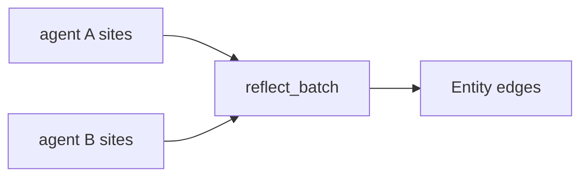

# Social Dynamics

Social dynamics integrate peer provenance, corroboration, contradiction, and feedback. They do not replace graph dynamics; they provide evidence that affects coupling, trust, and readout.

## Origin

Every site carries origin:

```text
peer_id
source_kind
session_id
scope
confidence
```

Origin allows the engine to answer who produced a fragment, where it came from, and how much initial confidence it should carry.

## Peer Trust

Trust is a calibrated evidence signal, not an authorization decision.

| Signal | Effect |
|---|---|
| source confidence | Initial weight for observation admission |
| corroboration | Raises trust and may strengthen entity/conductance links |
| contradiction | Creates tensions and may lower trust if repeatedly unresolved |
| positive feedback | Reinforces sites and peer reliability |
| negative feedback | Lowers retained action or trust through prediction error |

Trust updates must leave traces. The engine must not silently rewrite provenance.

## Cross-Agent Reflection

`reflect_batch` receives session summaries from multiple agents and links sites that share entity tags:



Reflection:

- uses metadata only,
- creates edges rather than merging nodes,
- does not call an LLM,
- preserves each source origin,
- returns a report of links created or skipped.

## Feedback-Based Work

Feedback is another committed interaction:

```text
dA_i = eta * (feedback_target - predicted_value_i)
```

Positive feedback can raise retained action and trust. Negative feedback can lower them. Both are bounded and traceable.

## Fast/Slow Learning

There is one learning rate `eta = 1 - 0.5^(1/N)` derived from the target co-activation count `N`, as in [interactions.md](interactions.md) and [conductance.md](conductance.md). Fast/slow behavior is not two independent constants; it is an optional data-justified refit of the same family with a smaller `N` for fast adaptation and a larger `N` for slow consolidation, fit only once data shows the two channels strengthen at different rates:

| Channel | Refit | Use |
|---|---|---|
| fast | small `N_fast` | recent explicit user feedback |
| slow | large `N_slow` | accumulated peer reliability |

This mirrors complementary learning systems: quick adaptation for local behavior, slow consolidation for durable trust. Both rates remain refits of one `N`, not separate base constants.

## Desirable Difficulty

Reinforcement can be larger when useful knowledge was harder to retrieve. A site that was low-salience but correct may deserve more work than a site that was already obvious.

```text
boost = f(retrieval_difficulty, positive_feedback)
```

This must be bounded and calibrated; it must not become direct salience editing.

## Safety Rules

- Scope visibility overrides trust.
- Peer trust never erases origin.
- Cross-agent reflection creates links, not merges.
- Feedback updates are bounded and traceable.
- Contradiction remains tension until evidence or policy resolves it.

## Cost

Reflection cost is proportional to the number of session nodes and shared entity tags. Feedback updates are proportional to selected sites and paths.

## Failure Conditions

- Private scope leakage through cross-agent reflection.
- Silent trust mutation without trace.
- Automatic truth judgment from peer majority alone.
- Feedback directly setting salience instead of updating reservoirs.

## Related Documents

- Origin fields are defined in [graph-model.md](../02-knowledge-model/graph-model.md).
- Peer trust is defined in [peer-identity.md](../02-knowledge-model/peer-identity.md).
- Scope promotion is defined in [scoping-promotion.md](../02-knowledge-model/scoping-promotion.md).
- Interaction boundaries are defined in [interactions.md](interactions.md).
- Readout integration is defined in [readout-scoring.md](readout-scoring.md).
