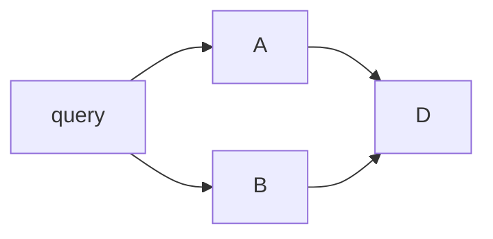

# Activation Flow

Activation flow computes the transient current that moves over the conductive memory network when a query field is applied. It is read-only. It does not change retained action, conductance, salience, edge weight, timestamps, or trust.

Persistent state contains:

- retained action `A_i`, the log prior need-odds for a site,
- conductance `C_ij`, the log likelihood ratio contributed by a cue/path.

Transient activation `a_i` is computed for the query and returned in the trace.

## Inputs

| Input | Meaning |
|---|---|
| query field `Q` | Text, embedding, seed, scope, and identity cues |
| seed vector `e` | L1-normalized restart distribution |
| conductance graph | Projected conductance and edge type factors |
| restart rate `alpha` | Derived from associative reach |
| max iterations | Hard iteration bound |
| tolerance | Convergence threshold |

## Conductance Matrix

For each site, outgoing edges are normalized into a row-stochastic transition matrix. `Contradicts` edges are excluded from propagation and handled by frustration.

```text
g_ij = project_conductance(C_ij) * edge_type_factor_ij
P(i, j) = g_ij / sum_k g_ik
I_ij = a_i * g_ij
```

Row normalization produces fan effect: a source with many outgoing edges contributes less per edge. Edge type factors are relative within a row; they do not create unbounded absolute activation.

## Iteration

```text
a_next = alpha * seed(Q) + (1 - alpha) * transpose(P) * a
```

This is Random-Walk-with-Restart / Personalized PageRank. Because `seed` is L1-normalized and `P` is row-stochastic, the operator has contraction modulus `(1 - alpha) < 1`. It converges geometrically to a unique fixed point.

There is no separate per-hop decay. One-hop attenuation is `(1 - alpha)`.

## Deriving `alpha`

`alpha` comes from associative reach. If influence should fall to factor `f` after `h_half` hops:

```text
(1 - alpha)^h_half = f
alpha = 1 - f^(1/h_half)
```

Or expose mean reach `L`:

```text
alpha = 1 / (L + 1)
```

The common `0.15` prior means roughly six-hop mean reach. It should be refit for different graph statistics.

## Evidence Summation

If two paths converge on one site, their contributions are summed, never maxed:



`D` receives current through both paths. This preserves the odds-form Bayesian meaning: posterior log odds add log-likelihood-ratio evidence.

Contradictory evidence is not added or subtracted here. It branches into frustration.

## Edge Factors

| Edge Type | Effect |
|---|---|
| `Reason` | Higher conductance for explanatory links |
| `ReinforcedBy` | Higher conductance for repeated evidence |
| `Semantic` | Standard conductance |
| `Temporal` | Weaker sequence conductance |
| `RejectedAlternative` | Low auxiliary conductance |
| `Refutes` | Debug relation, not ordinary support |
| `Contradicts` | Excluded from propagation |

## Outputs

| Output | Meaning |
|---|---|
| activation map | Site id to transient response `a*` |
| path current map | Edge id to `I_ij` |
| effective impedance | Approximate access cost from query field |
| iterations | Iteration count |
| residual | Final `||a_next - a||_1` |
| truncated | Whether max iterations stopped convergence |
| excluded_edges | Edges split to frustration |

`a*` is a global probability-like response and shrinks per site as graph size grows. Ranking must use top-k or percentile selection, not a fixed absolute threshold.

## Cost

Each iteration is linear in traversed frontier edges. Smaller `alpha` gives longer reach and slower convergence. Large graphs may use connected-component narrowing or forward-push approximation, preserving additive semantics.

## Failure Conditions

| Condition | Behavior |
|---|---|
| max iterations reached | Return current `a`, residual, `truncated = true` |
| seed disconnected | Return restart distribution; no propagation |
| contradiction-only region | Return no propagation, only frustration trace |
| graph-scale activation shrink | Use relative ranking, not absolute threshold |

## Related Documents

- Retrieval pipeline is defined in [pipeline.md](pipeline.md).
- Edge types are defined in [graph-model.md](../02-knowledge-model/graph-model.md).
- Readout is defined in [readout-scoring.md](../04-cognitive-dynamics/readout-scoring.md).
