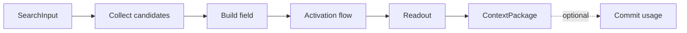

# Retrieval Pipeline

The retrieval pipeline converts user input into a structured `ContextPackage`. It combines lexical, vector, temporal, scope, identity, and graph cues, then computes activation flow and readout.

## Stages

| Stage | Purpose |
|---|---|
| input parse | Validate `SearchInput` or `Query` |
| candidate collection | Gather lexical, vector, entity, temporal, and explicit seeds |
| field construction | Convert candidate cues into a query potential field |
| activation flow | Run additive RWR over conductance |
| frustration split | Surface active contradictions as tensions |
| readout scoring | Rank and bucket activated sites |
| packaging | Build `ContextPackage` under token budget |
| optional commit | Integrate only if caller confirms use |

## Read And Commit

Search and query are read-only. They return context and trace. Commit is a separate operation or explicit engine path that consumes the trace and records used sites, paths, feedback, or tensions.

## Search Flow

`search` accepts text, optional embedding, scope, temporal filters, and limit. It returns a `SearchResult` with context and trace.

Candidate sources:

- full-text match,
- vector similarity,
- entity tag overlap,
- explicit seed ids,
- recent sites,
- scoped sites,
- identity priors.

Scores are fused into a seed distribution. Graph recall then reconstructs the surrounding context.

## Candidate Collection

Candidate collection should be broad enough to find the first cue but narrow enough to keep activation cheap. Each candidate source reports a score and provenance so the trace can explain why a site was seeded.

## Field Construction

Field construction turns candidate scores into a normalized restart distribution. It applies scope and trust gates before activation. It must not include sites that the query scope cannot see.

## Packaging

`ContextPackage` groups output into:

| Bucket | Content |
|---|---|
| identity | Active identity and state |
| knowledge | Semantic, procedural, entity, convention, decision, gotcha |
| memories | Episodic and event fragments |
| tensions | Active contradictions and stress explanations |
| trace | Optional explanation of retrieval decisions |

Packaging may choose L0/L1/L2 resolution per site to fit budget while preserving provenance.

## Budget Policy

- Token budget is enforced at packaging.
- Prefer high-score sites with lower resolution before dropping provenance.
- Tensions relevant to the query should not be silently discarded.
- A zero budget returns empty buckets and trace.

## Commit Effects

Commit can record:

- selected sites as accessed,
- path ids as used,
- co-readout pairs,
- feedback labels,
- presented tensions.

Commit validates that the trace still matches graph state. Read-only search never mutates reservoirs.

## Query Modes

| Mode | Behavior |
|---|---|
| `Associative` | Full activation-flow pipeline from seed |
| `TypeFiltered` | Structural retrieval by type, sorted by salience/readout policy |
| `Neighborhood` | k-hop BFS subgraph |
| `Temporal` | Valid-time or recency filtered retrieval |
| `List` | Sites above a salience threshold |

Associative mode uses the complete spreading-activation pipeline. Other modes still apply scope, validity, and packaging rules.

## Failure Conditions

- Missing required query input returns an error.
- Invalid scope path returns an error.
- No candidates returns empty context plus trace.
- Non-finite scores become error traces.
- Absolute activation thresholds are disallowed as final selection on large graphs.
- Commit without matching trace fails.

## Cost

Candidate collection depends on storage indexes. Activation is linear in traversed edges per iteration. Packaging is linear in selected candidates and token-cost estimates.

## Related Documents

- Activation flow is defined in [activation-flow.md](activation-flow.md).
- Readout scoring is defined in [readout-scoring.md](../04-cognitive-dynamics/readout-scoring.md).
- Scope rules are defined in [scoping-promotion.md](../02-knowledge-model/scoping-promotion.md).
- Storage indexes are defined in [storage.md](../03-persistence/storage.md).
