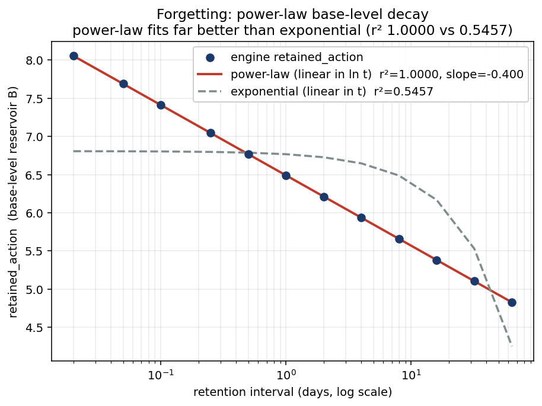
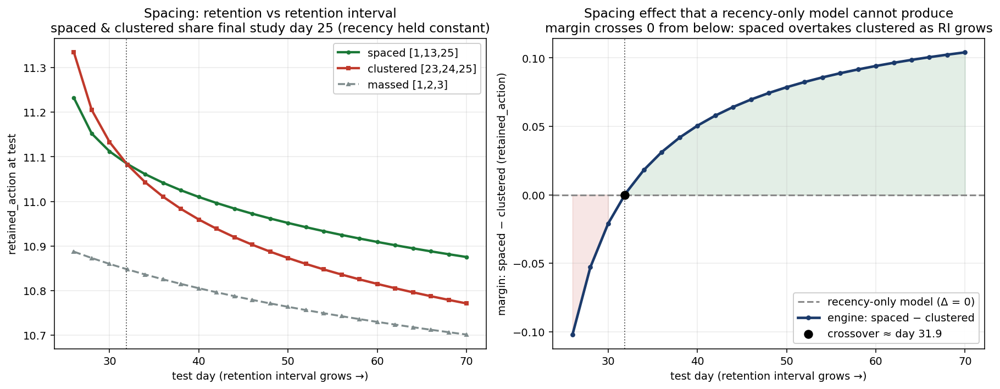
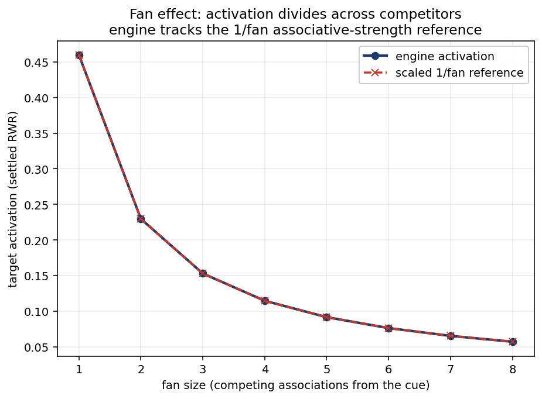

# Cognitive Fidelity: Results

These charts are produced by the **same engine** the CI fidelity gate
(`tests/cognitive_fidelity.rs`) drives. The gate asserts pass/fail; this page sweeps
the same paradigms over a dense parameter range and plots the raw engine numbers.
They are regenerable from a clean checkout in two commands (see
[Reproduce](#reproduce)): `benches/fidelity_showcase.rs` writes the CSVs and
`scripts/plot_showcase.py` renders the PNGs. Every plotted point is a real
`retained_action` / activation read from a freshly built deterministic graph —
nothing is hand-drawn or fabricated.

The engine implements Pavlik & Anderson (2005) activation-dependent per-trace decay:
`B_i = ln(Σ_j (now − t_j)^(−d_j))`, with `d_j = m_type·(c·e^{m_j} + α)`, locked
`α = 0.40`, `c = 2.0`, Episodic `m_type = 1.0`, Semantic `m_type = 0.40`.

## Forgetting: power-law base-level decay



A cohort of 50 Episodic nodes decays once from creation to a test delay (a fresh
cohort per delay — no cumulative ticks), for 12 delays spanning 0.02 to 64 days. We
plot the mean authoritative reservoir `retained_action` (the base-level `B`), not its
bounded `salience` projection, because a fresh node starts at the prior ceiling where
`salience ≈ 1.0` saturates and would hide the curve.

**What it shows:** the reservoir falls *linearly in ln t* — the signature of
power-law forgetting. A power-law (linear-in-`ln t`) fit lands essentially on top of
the points (r² ≈ 1.0) while an exponential / linear-in-time fit cannot follow the
shape (r² ≈ 0.55). The fitted slope is **−0.40**, which is exactly the calibrated
`−m_type·α` for an Episodic single trace.

**Honest framing:** this curve is log-linear *by construction* — the engine computes
`B = −d·ln(Δt)`. We are not claiming to have *discovered* power-law forgetting; we are
showing the engine matches the ACT-R power-law shape and that the power law fits far
better than an exponential, at the calibrated decay rate.

## Spacing × retention interval



Three study schedules, each with **three** study events, all stamped at their first
study day so the creation trace *is* the first study event (Pavlik & Anderson framing
— there is no synthetic day-0 trace, which would break the comparison):

- **spaced** `[1, 13, 25]` — distributed practice
- **clustered** `[23, 24, 25]` — massed late, but with the **same final study day
  (25)** as spaced, so recency is held constant between the two
- **massed** `[1, 2, 3]` — massed early

Each arm is ticked to the test day and we read `retained_action`. The left panel
shows the three retention curves; the right panel shows the margin
(spaced − clustered) against the **flat dashed line a recency-only model would
predict**.

**Why this is non-trivial:** spaced and clustered are last studied on the *same day*
(25). A model that depends only on time-since-last-access predicts **exactly zero**
difference between them — the dashed Δ = 0 line, drawn directly (no engine number is
fabricated for it). The engine's margin instead crosses from negative to positive: at
a short retention interval clustered's three tightly-packed recent traces still lead,
and spaced overtakes only at a sufficiently delayed test. The crossover sits at
**≈ day 32** (the margin is −0.021 at day 30 and +0.001 at day 32). A recency-only
model **cannot** produce a crossover, so its presence rules out a recency-only
explanation: the spaced advantage comes from activation-dependent per-trace decay
(spaced re-presentations are encoded at lower activation → lower `d_j` → more
durable), not from recency. The spaced > massed comparison (also plotted) is the classic textbook
result but is confounded by recency, so it is shown, not relied upon.

## Fan effect



One hub cue with N competing out-edges (fan size 1 to 8); we read the first target's
settled query-local activation when the random walk is seeded at the hub (read-only,
no mutation).

**What it shows:** target activation falls as the cue's associative strength is
divided across more competitors — *exactly* **1/fan**: the engine's row-stochastic RWR
splits the hub's outgoing probability equally across N edges, so activation(N) =
activation(1)/N (the dashed reference, anchored at fan = 1). This is the computational
form of Anderson's fan effect — more associations from a cue means weaker recall of
any one of them.

## What this does and does NOT show

**Reproduces** (each is a CI-gated paradigm in `tests/cognitive_fidelity.rs`):

- **Power-law forgetting** — base-level decay log-linear in time, power law far better
  than exponential, at the calibrated rate.
- **The spacing effect with its retention-interval crossover** — recency-controlled
  (spaced vs clustered share the final study day), which a recency-only model cannot
  produce.
- **The fan effect** — activation divides across competing associations.
- **Priming** — related cues raise a target's activation over unrelated ones, and
  contributions from multiple incoming paths *sum* rather than max-pool.
- **Contradiction as frustration** — a `Contradicts` edge surfaces stress that a
  matched non-contradiction control (identical fan, ordinary edge) does not.

**Does NOT show:**

- **The human testing effect** is *not* reproduced and is *not* claimed. The
  "commitment" paradigm verifies the engine's commit-vs-read-only invariant (committed
  retrieval reinforces a reservoir; read-only retrieval leaves it untouched) — that is
  an engine correctness property, not the psychological testing effect.
- These are mechanism-level fidelity checks on a deterministic synthetic graph, not a
  fit to a specific human behavioral dataset.

## Reproduce

```sh
cargo bench --bench fidelity_showcase        # writes target/fidelity-showcase/*.csv
python3 scripts/plot_showcase.py             # writes docs/07-quality-gates/assets/*.png
```

`python3 -m pip install matplotlib` if matplotlib is not already available. The CSVs
and PNGs are deterministic; re-running reproduces these exact charts.
